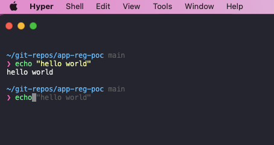

To set up a very developer friendly and coolest shell, do the following:

1. Install Hyper: https://hyper.is/
2. Install oh-my-zsh: https://github.com/robbyrussell/oh-my-zsh
3. Install https://github.com/sindresorhus/pure
4. Install https://github.com/zsh-users/zsh-syntax-highlighting
5. Install https://github.com/zsh-users/zsh-autosuggestions
6. Install https://github.com/sindresorhus/hyper-snazzy

Taken from this youtube video: https://www.youtube.com/watch?v=Cej5JMotDX0

